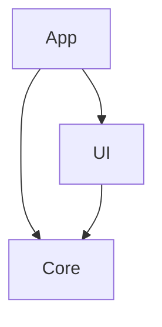

# Child 10.4 — Dependency Graph Visualizer: Result

## Status: Complete ✅

## What Was Delivered

### `swiftanvil deps graph [--format mermaid|dot]`

Generates dependency graph visualizations from `Package.swift`.

### Features

| Feature | Description |
|---|---|
| Mermaid output | `graph TD` diagram for Markdown/GitHub rendering |
| DOT output | GraphViz-compatible directed graph |
| Cycle detection | Reports circular dependencies before output |
| Target + package deps | Parses both internal target dependencies and external package URLs |

### Example Output

### Files Added

| File | Description |
|---|---|
| `Sources/SwiftAnvilCLI/Dependencies/DependencyGraphVisualizer.swift` | Graph parser and generators |
| `Sources/SwiftAnvilCLI/Commands/DependenciesCommand.swift` | CLI interface |
| `Tests/SwiftAnvilCLITests/DependencyGraphVisualizerTests.swift` | 4 tests |

### Tests

- `swift test` — 89/89 pass ✅ (4 new DependencyGraphVisualizer tests)

## Registry References

- `roadmap.org` — Phase 10 horizon 1
